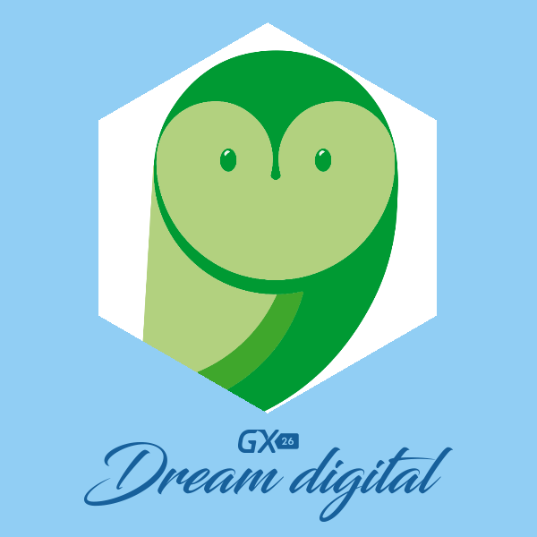

# GX26 RUDI

RUDI is the bot showed during the 26th Genexus Users Meeting held in Montevideo, Uruguay on Sept 2016.

The code here will not run correctly because you need to provide the necesary keys to access many cognitive services either from Microsoft or IBM (Watson).

It is still a good way of seeing how [LUIS](luis.ai/) can interact with other services either from [Micosoft](https://www.microsoft.com/cognitive-services) or [IBM Watson](http://www.ibm.com/watson/).

If you have any questions or concerns please file an [issue](/issues).

_For a limited time you will be able to try it live at its [own site](http://gxrudi.azurewebsites.net/) or on [Facebook](facebook.com/gxrudi) and chat to her on [Messenger](https://www.messenger.com/t/gxrudi)._
